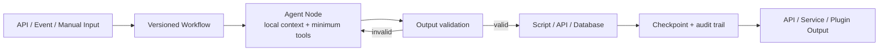

<div align="center">

<h1>
  <picture>
    <source media="(prefers-color-scheme: dark)" srcset="web/public/brand/determinflow-lockup-dark.svg">
    
  </picture>
</h1>

<p><strong>Deterministic workflows for probabilistic AI.</strong></p>

<p>Build, validate, recover, and ship complex AI workflows as dependable services.</p>

<p>
  <a href="https://github.com/alikon-art/DeterminFlow/releases"></a>
  <a href="https://github.com/alikon-art/DeterminFlow/actions/workflows/ci.yml"></a>
  <a href="https://github.com/alikon-art/DeterminFlow/blob/main/LICENSE"></a>
  
</p>

<p>
  <a href="#why-determinflow"><u>Why DeterminFlow</u></a> ·
  <a href="#production-proof"><u>Case study</u></a> ·
  <a href="#features"><u>Features</u></a> ·
  <a href="#quick-start"><u>Quick start</u></a> ·
  <a href="#plugins"><u>Plugins</u></a> ·
  <a href="#community"><u>Community</u></a>
</p>

<p><strong>English</strong> · <a href="README.md">简体中文</a></p>

</div>

<p align="center">
  <a href="https://novelbuilt.com/">
    
  </a>
</p>

<p align="center"><sub>A real chapter-production workflow: direction, context, specialist writers, synthesis, validation, rendering, and persistence.</sub></p>

DeterminFlow is a production-oriented AI workflow runtime. It turns LLM calls, scripts, APIs,
database operations, and human approvals into versioned, validated, retryable, recoverable, and
auditable workflows.

Each Agent owns one clearly bounded node: it receives only the context and tools needed for that
step and returns a verifiable result. DeterminFlow owns control flow, data flow, retries, and recovery.

> DeterminFlow has already been validated in the real AI novel production pipeline behind
> [NovelBuilt](https://novelbuilt.com/).

<a id="why-determinflow"></a>

## Why not just use Codex, Claude, or another single-agent framework?

Codex, Claude, and similar single-agent frameworks are excellent when the path is unknown. Once a
process is clear, asking one Agent to reread the full context, remember every step, and call every
tool usually makes the job slower, more expensive, and harder to maintain.

| Problem | Codex, Claude, and similar single-agent frameworks | DeterminFlow |
|---|---|---|
| Change the process | Edit prompts, skills, and natural-language constraints | Change versioned nodes, variables, branches, and subprocesses |
| Isolate context | Long runs typically carry a growing history forward | Each Agent Node sees only its local context |
| Enforce structured output | Rely on the model to keep following the agreement | Structured outputs, script validation, automatic repair, and targeted retries |
| Handle failures | Decide manually where to restart | Resume from the failed node without rerunning completed work |
| Limit permissions | One Agent typically receives the tools needed by the whole process | Each node receives only the tools it needs |
| Audit cost | Usage is typically aggregated around the whole task | Account for every node, attempt, and model call separately |
| Ship the result | Build an additional delivery layer | Package it as an API, background service, Automation, or Plugin |

The difference is practical:

- **Faster development:** Combine reliable nodes, validate the flow, then connect it to an API or service.
- **Easier maintenance:** Processes, parameters, and outputs have a stable structure instead of living in one large prompt.
- **More stable execution:** Models handle judgment while the Runtime owns control flow and data flow.
- **No full restart after failure:** Audit, retry, and recover any node without rerunning a long process from the beginning.
- **Fewer tokens:** Each model reads only the context it needs instead of repeatedly carrying the full history.
- **Smaller permissions:** Tools can be narrowed per node, with stronger LLM workspace sandboxing on the Roadmap.

<a id="production-proof"></a>

## Case study: saving 70%–89% of tokens in AI novel chapter production

[NovelBuilt](https://novelbuilt.com/) uses DeterminFlow to coordinate a chapter-production pipeline
with directors, world-state and character maintenance, specialist writers, synthesis, validation,
rendering, and persistence.

One completed production task used **11 isolated model sessions**. A single run in DeterminFlow
consumed **176,584 tokens**. If the same process were handled by one long-chain Agent carrying
repeated context, tool results, and repair loops, estimated token usage could reach **9.1×** that of
DeterminFlow:

| Single-agent scenario | Estimated total tokens | Relative to DeterminFlow | DeterminFlow saving | Terra API equivalent | Sol API equivalent |
|---|---:|---:|---:|---:|---:|
| Highly optimized, almost no extra tool loops | ~595K | 3.4× | ~70% | $0.90 | $2.26 |
| Typical tool calls and context growth | ~970K | 5.5× | ~82% | $1.47 | $3.68 |
| Validation repair, retries, or long context | ~1.61M | 9.1× | ~89% | $2.43 | $6.08 |

> Estimated from the real Workflow token ledger plus repeated context, tool output, and repair-loop
> overhead in a long-chain Agent; API prices reflect the rates used at the time of estimation.

In this real production workflow, node-level context isolation is estimated to reduce token usage by
roughly **70%–89%**.

<a id="features"></a>

## DeterminFlow's core capabilities

### Workflow authoring

- Visual Workflow Editor with variables, conditions, parallel branches, loops, approvals, and subprocesses
- Agent, Script, Approval, and Subprocess Core Nodes
- Per-node inputs, outputs, model selection, and failure policy
- A general Core Node abstraction for contributors and forks that need new node types

### Reliable execution

- Frozen Workflow definitions and inputs for every running task
- Automatic retry, manual retry, skip, and resume from the failed node
- Persistent checkpoints across process restarts
- Independent attempt history for parallel branches, loops, and subprocesses

### LLM boundaries

- Isolated sessions and token ledgers for every Agent Node
- Per-node tool allowlists, denylists, workspace configuration, and maximum turns
- JSON detection, parsing, repair, and model retry
- Directed upstream rejection when a downstream node needs a specific result corrected

### Delivery and operations

- Usage and status views across Workflow, Task, Node, attempt, and model call
- FastAPI endpoints, React control plane, Cron Automation, WebSocket events, and health checks
- MCP tools, Prompt and Agent templates, Skills, and Rules as reusable Workflow building blocks
- A standalone Core that does not require any product plugin

### One workspace around the Workflow

Conversation, Workflow authoring, Cron, Skills, Rules, and Plugins live in one control plane.


## How it works



1. Freeze the Workflow, parameters, and node inputs when a task starts.
2. Run each Agent Node in an independent session with only the tools it needs.
3. Repair, retry, skip, or request human input when an output fails validation.
4. Use Script Nodes for deterministic work such as file conversion, API calls, and persistence.
5. Store every attempt, error, token record, artifact, and checkpoint so execution can resume safely.

<a id="plugins"></a>

## Extension: deliver complete AI products as Plugins

DeterminFlow handles process execution. Plugins package the process with everything it needs to ship.
Common use cases include:

| Use case | What a Plugin can ship with it |
|---|---|
| Let a team or community install a mature process | Workflows, Agents, Prompts, Skills, Rules, and preset phrases |
| Turn a process into a callable business service | APIs, managed background processes, configuration, health checks, and lightweight pages |
| Deliver a stateful product workflow | Script Libraries, database migrations, persistence, and recovery logic |

### Official plugins and an open-source case study

Official plugins live in
[`DeterminFlow-Plugins`](https://github.com/alikon-art/DeterminFlow-Plugins). The
[`bishu-novel`](https://github.com/alikon-art/DeterminFlow-Plugins/tree/main/plugins/bishu-novel)
package is an open-source AI novel Workflow case drawn from NovelBuilt's production pipeline. Its
current public release contains:

| Production Workflows | Orchestration nodes | Agent / Prompt pairs | Reusable script modules |
|---:|---:|---:|---:|
| 7 | 84 | 33 | 15 |

It covers book setup, characters, story planning, volume and near-term outlines, chapter production,
post-hoc state updates, and polishing, together with APIs, SSE jobs, PostgreSQL migrations, and
checkpoint recovery. Plugins are the best way to package and deliver a complete AI business engine.

> [!NOTE]
> Plugins compose Workflows from existing Core Nodes. Developers who need a new node type can fork
> Core and extend the general Node abstraction.

> **Security note:** Plugins currently run as trusted local code without sandbox isolation. Install
> only trusted sources. Stronger per-node LLM and workspace sandboxing remains on the Roadmap.

<a id="quick-start"></a>

## Quick start 🚀

Python 3.11+, Node.js 22.12+, and npm are required. Choose the commands for your system.

### macOS / Linux

```bash
git clone https://github.com/alikon-art/DeterminFlow.git
cd DeterminFlow
python -m venv .venv
source .venv/bin/activate
python -m pip install -r requirements.lock
cp .env.example .env
cp config/models_config.example.json config/models_config.json
python run.py
```

### Windows PowerShell

```powershell
git clone https://github.com/alikon-art/DeterminFlow.git
Set-Location DeterminFlow
python -m venv .venv
.\.venv\Scripts\python.exe -m pip install -r requirements.lock
Copy-Item .env.example .env
Copy-Item config\models_config.example.json config\models_config.json
.\.venv\Scripts\python.exe run.py
```

You can start first and enter the API key on the Settings page. Alternatively, set
`DEEPSEEK_API_KEY` in `.env`; the model configuration reads it through
`${DEEPSEEK_API_KEY}`.

Then open:

- Web UI: `http://localhost:8020`
- API docs: `http://localhost:8020/docs`
- Plugin status: `GET /api/extensions`

Or start with Docker:

```bash
docker compose up --build
```

New configuration uses the `DETERMINFLOW_*` prefix. Existing `AI_COMPANY_*` environment variables
and the `ai_company.extensions` entry-point group remain supported as compatibility aliases; the new
name wins when both are set.

## Documentation

- [Architecture](docs/architecture.md)
- [Plugin Package specification](docs/plugin-packages.md)
- [Extension development guide](docs/extension-development.md)

## Development

```bash
python -m pip install -r requirements-dev.lock
python -m pytest -q
(cd web && npm run lint && npm run test:extensions && npm run build)
docker compose -f docker-compose.yml config -q
```

<a id="community"></a>

## Community and collaboration

| If you want to... | Start here |
|---|---|
| Report a bug or suggest a feature | [GitHub Issues](https://github.com/alikon-art/DeterminFlow/issues) |
| Discuss usage, Workflows, and Plugin development | Join the QQ or WeChat group below |
| Request custom Workflow or Plugin development, private deployment, or product integration | WeChat `Reactive404` · [Email](mailto:alikon.art@qq.com?subject=DeterminFlow%20cooperation) |

### Join the group chat

<table>
  <tr>
    <th align="center">QQ group</th>
    <th align="center">WeChat group</th>
  </tr>
  <tr>
    <td align="center" valign="top"><a href="http://qm.qq.com/cgi-bin/qm/qr?_wv=1027&amp;k=kRVWN5s7xlG8nc_f5fjdrpmd6mucbZoj&amp;authKey=1Xv1LWqUNiW5YgKYPvO8v%2F52s7JxRANMJ17wKrJCQSROw3%2BKf0%2B3BEIxstgEkg%2FM&amp;noverify=0&amp;group_code=945515407"></a></td>
    <td align="center" valign="top"></td>
  </tr>
  <tr>
    <td align="center"><a href="http://qm.qq.com/cgi-bin/qm/qr?_wv=1027&amp;k=kRVWN5s7xlG8nc_f5fjdrpmd6mucbZoj&amp;authKey=1Xv1LWqUNiW5YgKYPvO8v%2F52s7JxRANMJ17wKrJCQSROw3%2BKf0%2B3BEIxstgEkg%2FM&amp;noverify=0&amp;group_code=945515407">Group ID: <code>945515407</code></a></td>
    <td align="center">Temporary QR code, valid through August 9, 2026</td>
  </tr>
</table>

## Roadmap

- Complete the remaining internal compatibility-name migration to DeterminFlow
- Add stronger per-node workspace and LLM execution sandboxes
- Provide reusable templates for publishing a Workflow as an independent API or service
- Add more reproducible production Workflow examples
- Define the compatibility and versioning policy beyond `v0.1.0`

## License

DeterminFlow is licensed under the
[GNU AGPL v3](https://github.com/alikon-art/DeterminFlow/blob/main/LICENSE) (`AGPL-3.0-only`).

---

<p align="center">
  Created and maintained by alikon-art.<br>
  Built from the production workflow needs behind <a href="https://novelbuilt.com/">NovelBuilt</a>.
</p>
