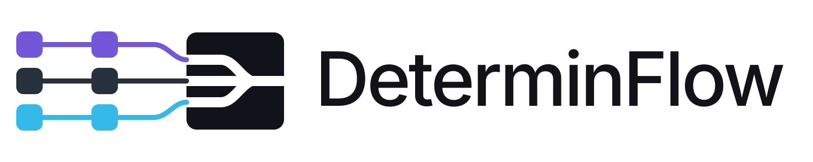
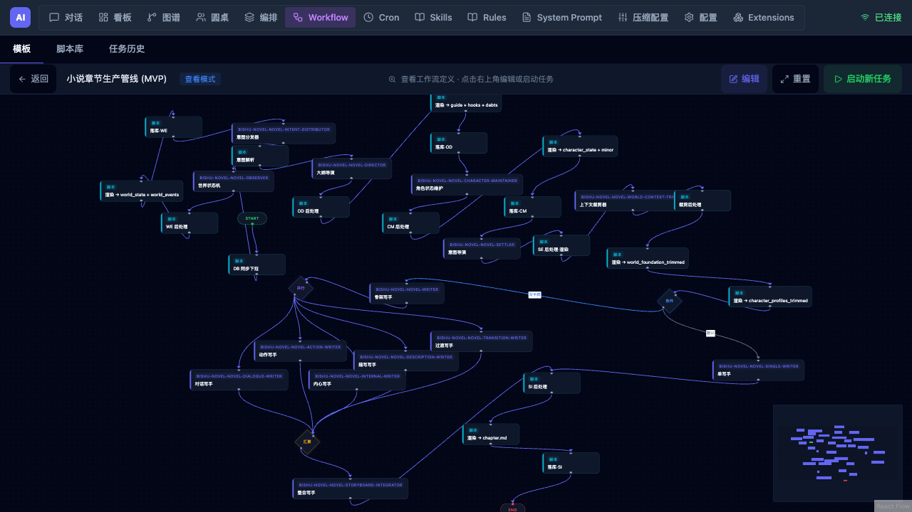
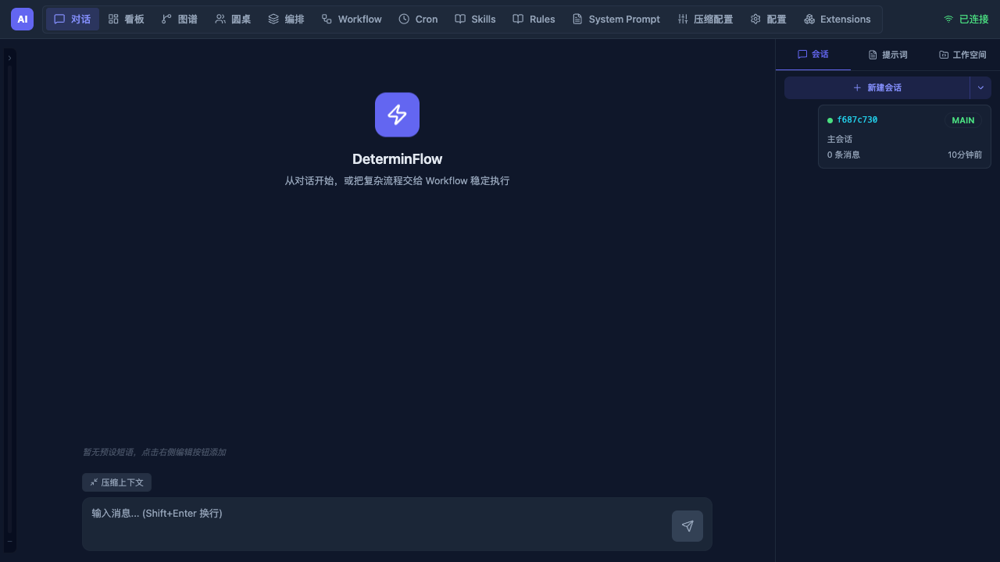
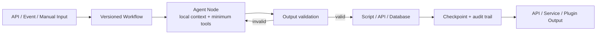
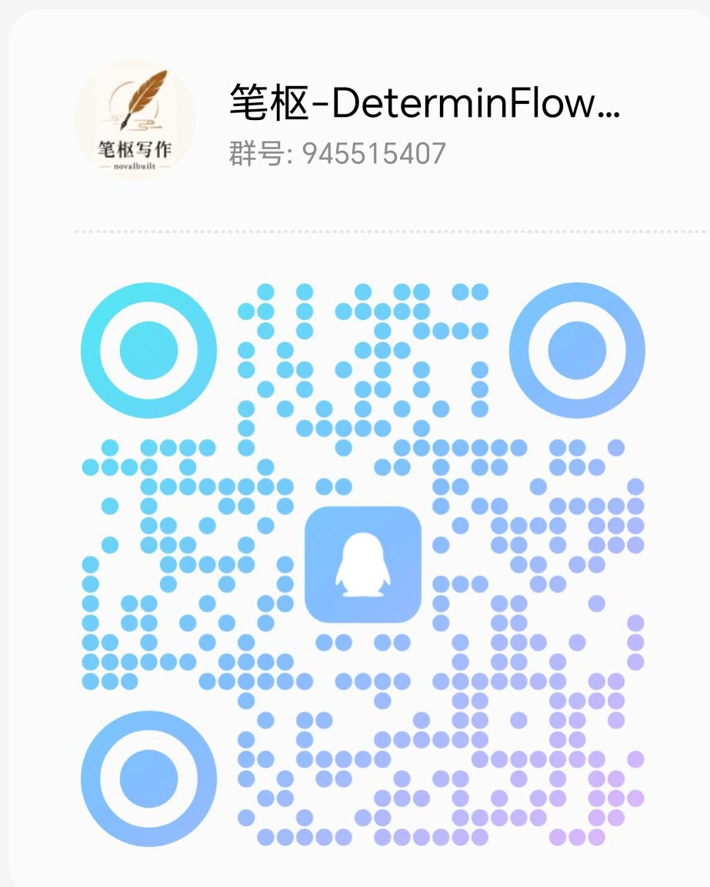

<div align="center">

<h1>
  <picture>
    <source media="(prefers-color-scheme: dark)" srcset="web/public/brand/determinflow-lockup-dark.svg">
    
  </picture>
</h1>

<p><strong>让不确定的模型，运行在确定的流程里。</strong></p>

<p>把复杂 AI 流程快速开发、验证、恢复，并稳定交付为服务。</p>

<p>
  <a href="https://github.com/alikon-art/DeterminFlow/releases"></a>
  <a href="https://github.com/alikon-art/DeterminFlow/actions/workflows/ci.yml"></a>
  <a href="https://github.com/alikon-art/DeterminFlow/blob/main/LICENSE"></a>
  
</p>

<p>
  <a href="#why-determinflow"><u>为什么是 DeterminFlow</u></a> ·
  <a href="#production-proof"><u>案例</u></a> ·
  <a href="#features"><u>主要能力</u></a> ·
  <a href="#quick-start"><u>快速开始</u></a> ·
  <a href="#plugins"><u>插件</u></a> ·
  <a href="#community"><u>社区与合作</u></a>
</p>

<p><a href="README.en.md">English</a> · <strong>简体中文</strong></p>

</div>

<p align="center">
  <a href="https://bishuxiezuo.cn/">
    
  </a>
</p>

<p align="center"><sub>真实正文生产流程：导演、上下文、专业写手、整合、校验、渲染与落库。</sub></p>

DeterminFlow 是一个面向生产的 AI 工作流运行框架。它把 LLM、脚本、API、数据库操作
和人工审批组织成有版本、可校验、可重试、可恢复、可审计的工作流。

每个 Agent 只负责一个边界清楚的节点：读取这一步需要的上下文，使用被授权的工具，
交付可校验的结果。DeterminFlow 负责控制流、数据流、重试与恢复，让整条流程稳定跑完。

> DeterminFlow 已经在 [笔枢写作](https://bishuxiezuo.cn/) 的真实 AI 小说生产链路中
> 完成生产验证。

<a id="why-determinflow"></a>

## 为什么不直接用 Codex、Claude 这类单智能体框架？

Codex、Claude 等单智能体框架很适合探索未知问题。但流程已经明确时，让一个 Agent
反复阅读全部上下文、自己记住每一步，还要负责调用所有工具，通常更慢、更贵，也更难维护。

| 要解决的问题 | Codex、Claude 等单智能体框架 | DeterminFlow |
|---|---|---|
| 改流程 | 修改 Prompt、Skill 和自然语言约束 | 调整版本化节点、变量、分支和子流程 |
| 上下文隔离 | 长链执行通常持续携带越来越长的历史 | 每个 Agent Node 只看自己的局部上下文 |
| 结构化输出 | 依赖模型持续遵守自然语言约定 | 结构化输出、脚本校验、自动修复和定向重试 |
| 失败处理 | 人工判断从哪里重来 | 从失败节点继续，已经完成的部分不用重跑 |
| 控制权限 | 单个 Agent 通常拿到整条流程所需的工具 | 每个节点只拿自己需要的工具 |
| 成本审计 | 消耗通常汇总在整次任务中 | 每个节点、尝试和模型调用单独记账 |
| 对外交付 | 需要额外搭建交付外壳 | 包装成 API、后台服务、Automation 或 Plugin |

带来的变化很直接：

- **开发更快：** 把可靠节点组合起来，验证通过就能接 API 或业务服务。
- **维护更轻松：** 流程、参数和输出都有固定结构，不靠一大段 Prompt 维持秩序。
- **运行更稳定：** 模型只处理需要判断的部分，控制流和数据流交给 Runtime。
- **失败不重来：** 任意节点都能审计、重试和恢复，长流程不必从头再跑。
- **Token 更省：** 每个模型只读取自己需要的上下文，不重复背完整历史。
- **权限更小：** 工具可以按节点收窄，更强的 LLM 工作区沙箱也在 Roadmap 中。

<a id="production-proof"></a>

## 案例：在 AI 小说正文生产环节中节省 70%–89% Token

[笔枢写作](https://bishuxiezuo.cn/) 使用 DeterminFlow 串起导演、世界状态、角色维护、多个
专业写手、整合、校验、渲染和落库，形成一条可以断点恢复的正文生产流程。

一次真实完成的生产任务包含 **11 个独立模型会话**，在 DeterminFlow 中运行一次共消耗
**176,584 Token**。如果把同一套流程交给一个长链 Agent，让它反复携带上下文、工具
结果和返工记录，估算 Token 消耗最高可达到 DeterminFlow 的 9.1 倍：

| 单智能体场景 | 估算总 Token | 相对 DeterminFlow | DeterminFlow 节省 | Terra API 等价成本 | Sol API 等价成本 |
|---|---:|---:|---:|---:|---:|
| 极度优化、几乎没有额外工具循环 | 约 59.5 万 | 3.4× | 约 70% | $0.90 | $2.26 |
| 正常工具调用与上下文增长 | 约 97.0 万 | 5.5× | 约 82% | $1.47 | $3.68 |
| 出现校验修复、重试或长上下文 | 约 161.0 万 | 9.1× | 约 89% | $2.43 | $6.08 |

> 以上基于真实 Workflow Token 账本，以及长链 Agent 重复携带上下文、工具结果和返工
> 的典型开销估算；成本按估算时的 API 输入 Token 单价换算。

在这条真正的生产流程中，使用节点级上下文隔离预计可以减少约 **70%–89%** 的 Token 消耗。

<a id="features"></a>

## DeterminFlow 的主要能力

### Workflow 编排

- 可视化 Workflow Editor，支持变量、条件、并行、循环、人工审批和子流程
- Agent、Script、Approval、Subprocess 四类 Core Node
- 每个节点独立配置输入、输出、模型和失败处理
- 通用 Core Node 抽象，贡献者或 Fork 可以继续开发新节点类型

### 可靠执行

- Task 启动时冻结 Workflow 定义和输入
- 自动重试、人工重试、跳过，以及从失败节点恢复
- 跨进程重启保存执行检查点
- 并行、循环和子流程拥有独立的尝试历史

### LLM 运行边界

- 每个 Agent Node 都有独立会话和 Token 账本
- 工具白名单、黑名单、Workspace 和最大轮次可以按节点配置
- JSON 输出检测、解析、修复和模型重试
- 下游节点可以拒绝结果，让上游定向返工

### 观察与交付

- 按 Workflow、Task、Node、尝试和模型调用查看状态与用量
- FastAPI、React 控制台、Cron Automation、WebSocket 事件和健康检查
- MCP、Agent/Prompt 模板、Skill 和 Rule 都可以成为 Workflow 的可复用资产
- Core 可以独立运行，不依赖任何业务 Plugin

### 围绕 Workflow 的统一工作区

对话、Workflow、Cron、Skills、Rules 和 Plugins 都在同一个控制台中。



## 它怎么工作



1. Task 启动时冻结 Workflow、参数和节点输入。
2. Agent Node 在独立会话中运行，只装配自己需要的工具。
3. 输出不合格时修复、重试、跳过，或者请求人工处理。
4. Script Node 负责文件转换、API 调用和数据库落库等确定性工作。
5. 每次尝试、错误、Token、产物和检查点都会保存，进程重启后仍可继续。

<a id="plugins"></a>

## 扩展：用 Plugin 交付完整的 AI 业务

DeterminFlow 解决流程怎么执行，Plugin 则把它和运行所需的能力一起打包交付。常见场景
包括：

| 使用场景 | 可以随 Plugin 一起交付 |
|---|---|
| 把成熟流程交给团队或社区安装 | Workflow、Agent、Prompt、Skill、Rule 和预设短语 |
| 把流程直接变成可调用的业务服务 | API、托管后台进程、配置、健康检查和轻量页面 |
| 交付需要持久化的完整业务 | Script Library、数据库迁移、落库与恢复逻辑 |

### 官方插件与开源案例

官方插件统一发布在
[`DeterminFlow-Plugins`](https://github.com/alikon-art/DeterminFlow-Plugins)。其中
[`bishu-novel`](https://github.com/alikon-art/DeterminFlow-Plugins/tree/main/plugins/bishu-novel)
是从笔枢写作真实生产链路整理出的开源 AI 小说 Workflow 案例。当前公开版包含：

| 生产 Workflow | 编排节点 | Agent / Prompt 组合 | 可复用脚本模块 |
|---:|---:|---:|---:|
| 7 | 84 | 33 | 15 |

它覆盖建书、角色、故事规划、卷纲与近纲、正文生产、章节后验和润色，并带有配套 API、
SSE Job、PostgreSQL 迁移和断点恢复。Plugin 是你打包交付一套完整 AI 业务引擎的最佳选择。

> [!NOTE]
> Plugin 使用现有 Core Node 组合 Workflow。需要新节点类型时，可以 Fork Core 并扩展
> 通用 Node 抽象。

<a id="quick-start"></a>

## 快速开始 🚀

要求 Python 3.11+、Node.js 22.12+ 和 npm。根据你的系统选择一组命令。

### macOS / Linux

```bash
git clone https://github.com/alikon-art/DeterminFlow.git
cd DeterminFlow
python -m venv .venv
source .venv/bin/activate
python -m pip install -r requirements.lock
cp .env.example .env
cp config/models_config.example.json config/models_config.json
python run.py
```

### Windows PowerShell

```powershell
git clone https://github.com/alikon-art/DeterminFlow.git
Set-Location DeterminFlow
python -m venv .venv
.\.venv\Scripts\python.exe -m pip install -r requirements.lock
Copy-Item .env.example .env
Copy-Item config\models_config.example.json config\models_config.json
.\.venv\Scripts\python.exe run.py
```

可以先启动再到设置页面填写 API Key；也可以在 `.env` 中填写
`DEEPSEEK_API_KEY`，模型配置通过 `${DEEPSEEK_API_KEY}` 读取它。

启动后可以访问：

- Web UI：`http://localhost:8020`
- API 文档：`http://localhost:8020/docs`
- Plugin 状态：`GET /api/extensions`

也可以使用 Docker：

```bash
docker compose up --build
```

新配置统一使用 `DETERMINFLOW_*` 前缀；已有的 `AI_COMPANY_*` 环境变量和
`ai_company.extensions` Entry Point 继续作为兼容别名使用，新旧配置同时存在时以新名称为准。

## 文档

- [架构说明](docs/architecture.md)
- [Plugin Package 规范](docs/plugin-packages.md)
- [Extension 开发指南](docs/extension-development.md)

## 开发与验证

```bash
python -m pip install -r requirements-dev.lock
python -m pytest -q
(cd web && npm run lint && npm run test:extensions && npm run build)
docker compose -f docker-compose.yml config -q
```

<a id="community"></a>

## 社区与合作

| 如果你想…… | 可以从这里开始 |
|---|---|
| 报告问题或提出建议 | [GitHub Issues](https://github.com/alikon-art/DeterminFlow/issues) |
| 交流使用经验，讨论 Workflow 和 Plugin 开发 | QQ 群或微信群（下方扫码） |
| 定制 Workflow、Plugin、私有部署或产品集成 | 微信 `Reactive404` · [邮箱](mailto:alikon.art@qq.com?subject=DeterminFlow%20cooperation) |

### 加入群聊

<table>
  <tr>
    <th align="center">QQ 群</th>
    <th align="center">微信群</th>
  </tr>
  <tr>
    <td align="center" valign="top"><a href="http://qm.qq.com/cgi-bin/qm/qr?_wv=1027&amp;k=kRVWN5s7xlG8nc_f5fjdrpmd6mucbZoj&amp;authKey=1Xv1LWqUNiW5YgKYPvO8v%2F52s7JxRANMJ17wKrJCQSROw3%2BKf0%2B3BEIxstgEkg%2FM&amp;noverify=0&amp;group_code=945515407"></a></td>
    <td align="center" valign="top"></td>
  </tr>
  <tr>
    <td align="center"><a href="http://qm.qq.com/cgi-bin/qm/qr?_wv=1027&amp;k=kRVWN5s7xlG8nc_f5fjdrpmd6mucbZoj&amp;authKey=1Xv1LWqUNiW5YgKYPvO8v%2F52s7JxRANMJ17wKrJCQSROw3%2BKf0%2B3BEIxstgEkg%2FM&amp;noverify=0&amp;group_code=945515407">群号：<code>945515407</code></a></td>
    <td align="center">临时二维码，2026 年 8 月 9 日前有效</td>
  </tr>
</table>

## Roadmap

- 完成内部兼容标识的 DeterminFlow 命名迁移
- 为每个 Agent Node 提供更强的 Workspace 与 LLM 执行沙箱
- 完善 Workflow 到独立 API / Service 的发布模板
- 增加更多可复现的生产级 Workflow 案例
- 确定 `v0.1.0` 之后的兼容与版本策略

## License

DeterminFlow 使用
[GNU AGPL v3](https://github.com/alikon-art/DeterminFlow/blob/main/LICENSE)（`AGPL-3.0-only`）许可证。

---

<p align="center">
  由 alikon-art 创建并维护。<br>
  来自 <a href="https://bishuxiezuo.cn/">笔枢写作</a> 真实 AI 小说生产流程的实践。
</p>
